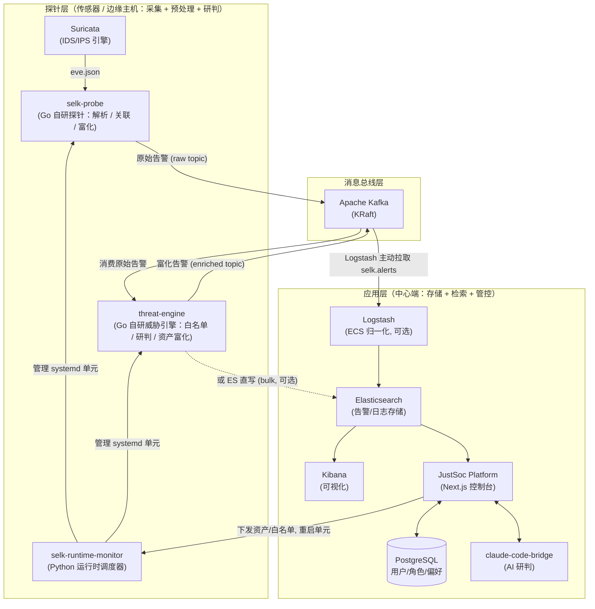
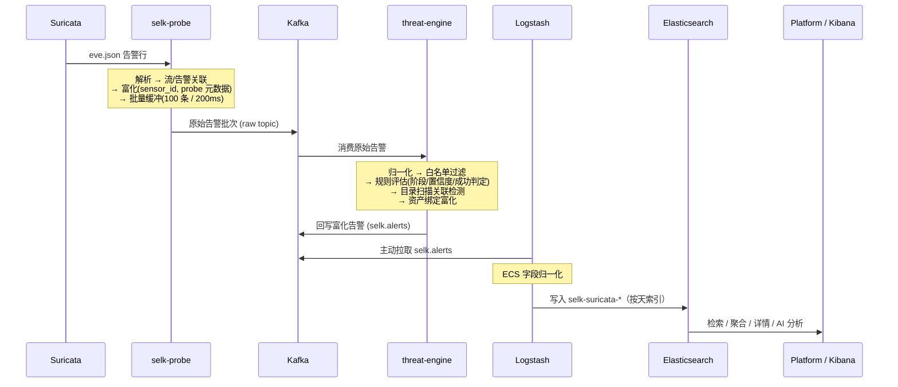

# JustSoc — 仿真企业级开源态势感知系统

JustSoc 是一套**仿真企业级架构的开源态势感知系统**，用于**学习与研究**安全告警采集、传输、研判、检索与可视化的端到端建设：把 **Suricata** 的原始告警，经过自研探针与威胁引擎的关联、富化、研判后，统一沉淀到 **Elasticsearch**，并通过自研的 Next.js 控制台进行检索、聚合、资产关联与 AI 辅助分析。

它刻意采用与企业级态势感知 / SOC 相近的分层与解耦架构（采集 / 传输 / 分析 / 应用各层独立演进），让你能在一个可完整跑通的真实链路上理解每个环节是如何协作的。

> ### ⚠️ 项目定位
>
> - **这不是一个成熟商业产品**，而是面向**学习与研究**的参考实现。
> - 采用与**企业级态势感知 / SOC 类似的架构**：分层、解耦、可独立扩缩容，每个组件职责单一。
> - **可用于生产环境**部署，但**不保证稳定性**——请自行做好评估、加固与监控后再用于关键业务。
> - 欢迎用它来学习 IDS → 消息总线 → 威胁研判 → 检索分析的完整数据流，或作为自建态势感知平台的脚手架。

---

## 目录

- [项目定位](#-项目定位)
- [整体架构](#整体架构)
- [组件清单](#组件清单)
  - [自研服务](#自研服务)
  - [中间件 / 基础设施](#中间件--基础设施)
- [数据分析流程](#数据分析流程)
- [关键设计](#关键设计)
- [目录结构](#目录结构)
- [构建与运行](#构建与运行)

---

## 整体架构

JustSoc 分为三个层次：**探针层**（部署在传感器/边缘主机，负责采集、预处理与研判：Suricata + probe + engine + monitor）、**消息总线层**（Kafka，解耦采集与研判）、**应用层**（部署在中心端，负责存储、检索与管控：ELK + PostgreSQL + Platform）。自研服务负责业务逻辑，中间件负责传输、存储与可视化。



> 图例：实线为默认数据通路（探针 → Kafka → 引擎研判 → 回写 Kafka → **Logstash 主动拉取** → ES → 平台/Kibana）；虚线为可选的引擎 ES 直写通路（跳过 Logstash）。

---

## 组件清单

### 自研服务

| 服务 | 路径 | 语言/框架 | 职责 |
|------|------|-----------|------|
| **selk-probe**（探针） | `rules-engine/probe` | Go 1.22 | 托管并监督 Suricata 进程；尾随 `eve.json`，解析、**流/告警关联**、富化（`sensor_id`、`ingested_at`、探针元数据），分批投递到 Kafka；内置健康检查 HTTP 服务；通过 `fsnotify` **热加载规则与白名单**。 |
| **threat-engine**（威胁引擎） | `rules-engine/go-engine` | Go 1.22 | 从 Kafka 消费原始告警 → 归一化 → **白名单过滤** → 规则评估（攻击阶段、置信度、**攻击是否成功**、目录扫描关联检测）→ **资产绑定富化** → **回写 Kafka（富化 topic）由 Logstash 拉取入库**（默认），或直接 bulk 写入 Elasticsearch（可选）。 |
| **JustSoc Platform**（控制台） | `platform` | Next.js 14 / React 18 / TS | 运营管理界面：总览仪表盘、告警检索/聚合/详情、日志检索、资产管理、权限管控（用户/角色、验证码登录、会话）、系统设置、**AI 告警分析**、**配置下发（Dispatcher）**、运行时重启等。数据读自 Elasticsearch，元数据存 PostgreSQL。 |
| **claude-code-bridge** | `platform/claude-code-bridge` | Node/TS | 可选的 Claude 桥接服务，为告警提供 AI 调查/研判能力。 |
| **runtime-monitor / control** | `rules-engine/monitor` | Python + Shell | 探针侧常驻 HTTP 调度器：轮询健康、暴露运行时快照、应用资产文档、按需重启 probe/engine 的 systemd 单元；`selk-runtime-control.sh` 负责签名并提交重启请求。 |

### 中间件 / 基础设施

| 中间件 | 镜像/版本 | 在架构中的作用 |
|--------|-----------|----------------|
| **Suricata** | IDS/IPS 引擎 | 抓包并按规则产生告警，输出 `eve.json`（探针的数据源头）。 |
| **Apache Kafka** | `apache/kafka:3.7.0`（KRaft，无 ZooKeeper） | 消息总线，**两次居中解耦**：承载探针产出的「原始告警」topic，以及引擎研判后回写的「富化告警 `selk.alerts`」topic。 |
| **Logstash** | `logstash:8.12.2` | 默认 ETL 通路：**主动从 Kafka 拉取** `selk.alerts`，做 ECS 字段归一化（`source.ip`/`rule.name`/`event.severity` 等），按天写入 `selk-suricata-*` 索引。 |
| **Elasticsearch** | `elasticsearch:8.12.2` | 告警与日志的存储与检索引擎，控制台与 Kibana 的统一数据底座。 |
| **Kibana** | `kibana:8.12.2` | 开箱即用的可视化与探索界面。 |
| **PostgreSQL** | via `pg` 驱动 | 平台关系型元数据：用户、角色、会话、告警/日志展示偏好等。 |

---

## 数据分析流程

一条网络攻击事件从产生到可分析，经过下面 6 个阶段。每个阶段都有明确的「输入 → 处理 → 输出」契约。



**1. 采集（Suricata → 探针）**
Suricata 依据 `suricata-rules/` 下的规则集进行检测，将告警以 EVE JSON 写入 `eve.json`。`selk-probe` 在 `managed` 模式下直接监督 Suricata 进程，并 `tail` 该文件。

**2. 预处理与关联（selk-probe）**
探针逐行解析 EVE 事件，按时间窗口做**流/告警关联**（`correlator`），把同一会话的上下文聚合到一起；再统一打上 `sensor_id`、`ingested_at` 时间戳以及探针主机/网卡/标签等元数据，最后以「最多 100 条 / 每 200ms 刷新」的批次推送到 Kafka，兼顾吞吐与时延。

**3. 传输（Kafka）**
Kafka 作为缓冲与解耦层，让探针与引擎可以独立扩缩容、独立重启，避免突发流量直接冲击下游。

**4. 研判与富化（threat-engine）**
引擎是分析链路的核心：
- **归一化**：把原始 EVE 字段映射为内部 `ThreatEvent`；
- **白名单过滤**：命中白名单的事件直接丢弃，并按规则统计跳过量；
- **规则评估**：依据规则库判定攻击阶段（`attempt` 等）、置信度（`low`/`medium`/…）与**攻击是否成功**（`attack_success`），并内置**目录扫描关联检测**（单位时间内的去重路径数与错误率超阈值即合成告警，SID `2900001`）；
- **资产富化**：将源/目的 IP 与资产清单绑定，补全业务/责任人等上下文；
- **回写总线**：默认 `kafka` 模式，将富化后的告警**再次写回 Kafka**（`selk.alerts` 富化 topic）；也可选 `es` 模式直接 bulk 写入 ES（跳过 Logstash）。

**5. 拉取与归一化（Logstash → Elasticsearch）**
默认通路下，**Logstash 主动从 Kafka 拉取** `selk.alerts`（消费组 `logstash-selk`），补齐 ECS 标准字段（`source.ip`/`rule.name`/`event.severity` 等）后按天写入 `selk-suricata-*` 索引。引擎与 Logstash 之间再次以 Kafka 解耦，互不阻塞。

**6. 分析与运营（Platform / Kibana）**
控制台基于 ES 提供告警检索、字段聚合、告警详情、日志检索与资产视图，并支持调用 AI（`claude-code-bridge`）对单条告警做结构化研判；运营人员还可在控制台编辑白名单/资产并通过 runtime-monitor **下发到探针**，规则与配置变更由探针 `fsnotify` **热加载**，无需重启。

---

## 关键设计

- **两次 Kafka 解耦**：Kafka 在链路中出现两次——探针↔引擎（原始 topic）、引擎↔Logstash（富化 topic），各环节可独立扩缩容、独立重启，任一侧故障都不丢链路。
- **批处理流水线**：探针发布循环采用「积满即发 / 超时即刷」双触发（`publishBatchSize=100`、`publishFlushInterval=200ms`），在高 EPS 下保持稳定吞吐。
- **热加载**：Suricata 规则与白名单通过 `fsnotify` 监听目录变化，去抖后自动重建配置并平滑重启 Suricata。
- **可插拔落库**：引擎 sink 支持 `kafka`（默认，回写富化 topic 交由 Logstash 拉取归一化）与 `es`（直写 ES，跳过 Logstash）两种模式。
- **daemon 化运维**：探针/引擎以 systemd 单元运行，由 `selk-runtime-monitor` 统一做健康轮询、配置下发与受控重启。

---

## 目录结构

```
JustSoc/
├── docker-compose.yml         # Kafka + Elasticsearch + Logstash + Kibana 一键栈
├── logstash.conf              # Logstash 从 Kafka 拉取并做 ECS 归一化的管道
├── platform/                  # Next.js 控制台（自研）
│   ├── app/                   #   页面与 API 路由（overview/alerts/logs/assets/access/ai/dispatcher…）
│   ├── lib/                   #   告警分析、调查、偏好存储等业务逻辑
│   ├── components/            #   告警详情、字段面板等 UI 组件
│   └── claude-code-bridge/    #   可选 AI 研判桥接服务
└── rules-engine/
    ├── probe/                 # selk-probe 探针源码（Go）
    │   └── internal/          #   eve / pipeline(correlator) / enrich / kafka / supervisor …
    ├── go-engine/             # threat-engine 威胁引擎源码（Go）
    │   └── internal/          #   consumer / normalize / evaluate / correlate / assets / whitelist / sink
    ├── suricata-rules/        # Suricata 检测规则集（web-rce / web-sqli / web-log4j …）
    ├── monitor/               # 运行时调度器与控制脚本（Python/Shell）
    └── deploy/                # 探针侧部署包构建与安装脚本
```

---

## 构建与运行

生产/实验部署建议按下面顺序执行：先部署探针侧 Kafka，再安装探针与规则引擎，最后启动分析平台。环境要求：Docker + Docker Compose、Go 1.22+（重新构建探针侧二进制时需要）、Node.js 22+ / npm（本地构建平台时需要）。

### 1. 部署 Kafka 消息总线

Kafka 随探针侧部署，位于 `rules-engine/deploy/`，用于承载 `selk.suricata.eve` 原始告警 topic 和 `selk.alerts.enriched` 富化告警 topic。

```bash
cd rules-engine/deploy
cp configs/probe-stack.env.example configs/probe-stack.env
cp .env.example .env  # 如果部署包中尚未存在 .env，则从示例复制
```

编辑 `rules-engine/deploy/.env`，重点确认：

```env
KAFKA_EXTERNAL_HOST=<探针主机实际网卡IP>
KAFKA_EXTERNAL_PORT=9092
KAFKA_SASL_USERNAME=kafka
KAFKA_SASL_PASSWORD=<强密码>
```

注意：`KAFKA_EXTERNAL_HOST` 最好不要填写 `127.0.0.1` 或 `localhost`。这里是 Kafka 对 probe、threat-engine 和远端 Logstash 公告的访问地址，应填写探针主机对外可达的实际网卡 IP，例如 `192.168.1.10`。

启动 Kafka：

```bash
docker compose up -d
docker compose ps
docker compose logs -f kafka kafka-init-topics
```

确认 `kafka-init-topics` 正常退出，Kafka 日志没有认证、监听地址或 topic 创建错误。

### 2. 部署探针和规则引擎

仍在 `rules-engine/deploy/` 目录中，先编辑 `configs/probe-stack.env`。关键项需要和 Kafka 的 `.env` 保持一致：

```env
SELK_PROBE_INTERFACE=<采集网卡，多个网卡可用 eth0,eth1>
SELK_KAFKA_BOOTSTRAP_SERVERS=<探针主机实际网卡IP>:9092
SELK_KAFKA_USERNAME=kafka
SELK_KAFKA_PASSWORD=<与 Kafka .env 一致>
```

生成探针与 Suricata 配置：

```bash
./init-config.sh
```

`init-config.sh` 会生成：

- `configs/probe.yaml`
- `configs/suricata.generated.yaml`
- `configs/probe-whitelist.generated.bpf`

安装 systemd 服务并启动探针、规则引擎和 runtime monitor：

```bash
sudo ./install.sh
```

安装后检查服务状态和日志：

```bash
systemctl status selk-probe justsoc-threat-engine selk-probe-dispatcher
journalctl -u selk-probe -f
journalctl -u justsoc-threat-engine -f
journalctl -u selk-probe-dispatcher -f
tail -f /var/log/suricata/eve.json
ls -lah /var/log/selk
```

重点观察 `/var/log/suricata/eve.json` 是否持续写入、`/var/log/selk/` 下相关日志是否有 Kafka 连接失败、SASL 认证失败、Suricata 启动失败或规则加载失败。

### 3. 部署分析平台

回到仓库根目录执行 `start.sh`。该脚本会根据提示生成/更新根目录 `.env`，构建并启动 Elasticsearch、Logstash、Kibana、PostgreSQL 和 JustSoc Platform。

```bash
cd ../../
chmod +x start.sh
./start.sh
```

按提示填写 Kafka 参数，必须和探针侧保持一致：

```env
KAFKA_BOOTSTRAP=<探针主机实际网卡IP>:9092
KAFKA_SASL_USERNAME=kafka
KAFKA_SASL_PASSWORD=<与探针侧一致>
```

同样不要把 `KAFKA_BOOTSTRAP` 写成 `127.0.0.1:9092`，除非 Kafka 和 Logstash/平台容器运行在同一台主机且容器网络能正确访问该地址。常规部署应填写探针主机实际网卡 IP。

启动完成后访问：

- Platform: `http://<平台主机IP>:3000`
- Kibana: `http://<平台主机IP>:5601`
- Elasticsearch: `http://<平台主机IP>:9200`

检查平台侧日志：

```bash
docker compose ps
docker compose logs -f logstash
docker compose logs -f platform
docker compose logs -f elasticsearch
```

如果 Logstash 没有消费到数据，优先检查三处配置是否一致：探针侧 Kafka `.env`、探针侧 `configs/probe-stack.env`、根目录平台 `.env`。
